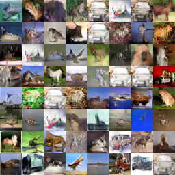
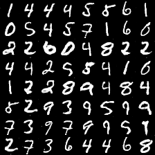

## Deep Convolutional Generative Adversarial Networks (DCGAN)

TensorFlow implementation of [Unsupervised Representation Learning with Deep Convolutional Generative Adversarial Networks](https://arxiv.org/abs/1511.06434). 

The DCGAN model is defined in [here](https://github.com/conan7882/DeepVision-tensorflow/tree/master/algorithms/GAN).

Please refer to the docs (coming soon) for custom configuration of the model and the callbacks setup.

## Requirements
- Python 3.3+
- [Tensorflow 1.0+](https://www.tensorflow.org/)
- [TensorCV](https://github.com/conan7882/DeepVision-tensorflow)

## Usage
### Config path

### Run script

You can run this script on CIFAR10, MNIST dataset as well as you own dataset in format of Matlab .mat files and image files.

To train a model in CIFAR10 and MNIST:

	$ python DCGAN.py --train --cifar --batch_size 32
	$ python DCGAN.py --train --mnist --batch_size 32

To train on custom dataset:

.mat files:

	$ python DCGAN.py --train --matlab --batch_size 32 --mat_name MAT_NAME_IN_MAT_FILE

images files:

	$ python DCGAN.py --train --image --batch_size 32 --type IMAGE_FILE_EXTENSION(start with '.')
	 
To test using an exist model, input image size and channels need to be specified, and the batch size has to be the same as training:

	$ python DCGAN.py --predict --batch_size SAME_AS_TRAINING \
	--h IMAGE_HEIGHT --w IMAGE_WIDTH --input_channel NUM_INPUT_CHANNEL
	
**Please note, all the images should have the same size.**

## Training Details
- training rate
- training step
- init

## Default Summary
### Scalar:
- loss of generator and discriminator

### Histogram:
- gradients of generator and discriminator
- discriminator output for real image and generated image

### Image
- real image and generated image

## Costum Configuration
*details can be found in docs (comming soon)*
### Available callbacks:

- TrainSummary()
- CheckScalar()
- GANInference()
 
### Available inferencer:
- InferImages()

## Results

### CIFAR10

### MNIST

*More results will be added later.*

